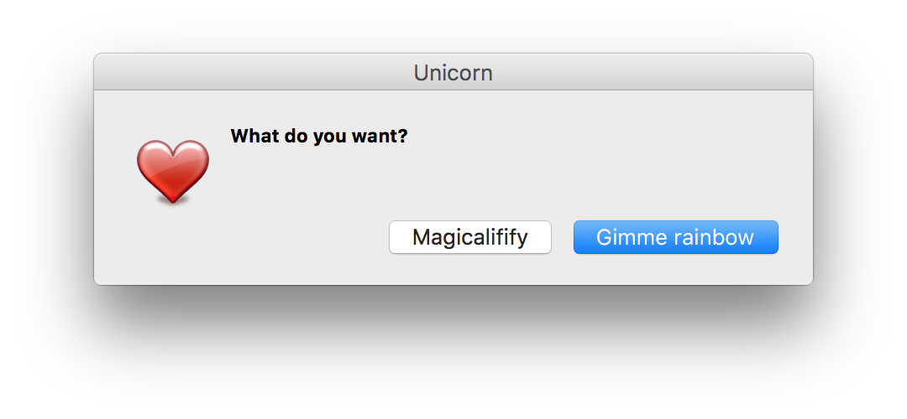

# cocoa-dialog

> Display common GUI dialogs on macOS using [cocoaDialog](https://github.com/cocoadialog/cocoadialog)



*Issues regarding the GUI should be opened on the cocoaDialog [issue tracker](https://github.com/cocoadialog/cocoadialog/issues).*


## Install

```
$ npm install cocoa-dialog
```


## Usage

```js
const cocoaDialog = require('cocoa-dialog');

(async () => {
	const result = await cocoaDialog('msgbox', {
		title: 'Unicorn',
		icon: 'favorite',
		text: 'What do you want?',
		button1: 'Gimme rainbow',
		button2: 'Magicalifify'
	});

	if (result === '1') {
		console.log('button1 clicked');
	} else if (result === '2') {
		console.log('button2 clicked');
	}
})();
```


## API

### cocoaDialog(type, options)

Returns a `Promise`.

#### type

Type: `string`<br>
Values:

- `bubble`
- `msgbox`
- `ok-msgbox`
- `yesno-msgbox`
- `inputbox`
- `standard-inputbox`
- `secure-inputbox`
- `secure-standard-inputbox`
- `fileselect`
- `filesave`
- `textbox`
- `progressbar`
- `dropdown`
- `standard-dropdown`

See the [cocoaDialog docs](http://mstratman.github.io/cocoadialog/#documentation3.0).

#### options

Type: `Object`

Any of the options defined in the [cocoaDialog docs](http://mstratman.github.io/cocoadialog/#documentation3.0) can be used in a camelCased form.<br>
For example, `‑‑informative‑text` should be `informativeText: true`.


## Related

- [error-dialog](https://github.com/sindresorhus/error-dialog) - Display an error in a GUI dialog


## License

MIT © [Sindre Sorhus](https://sindresorhus.com)
